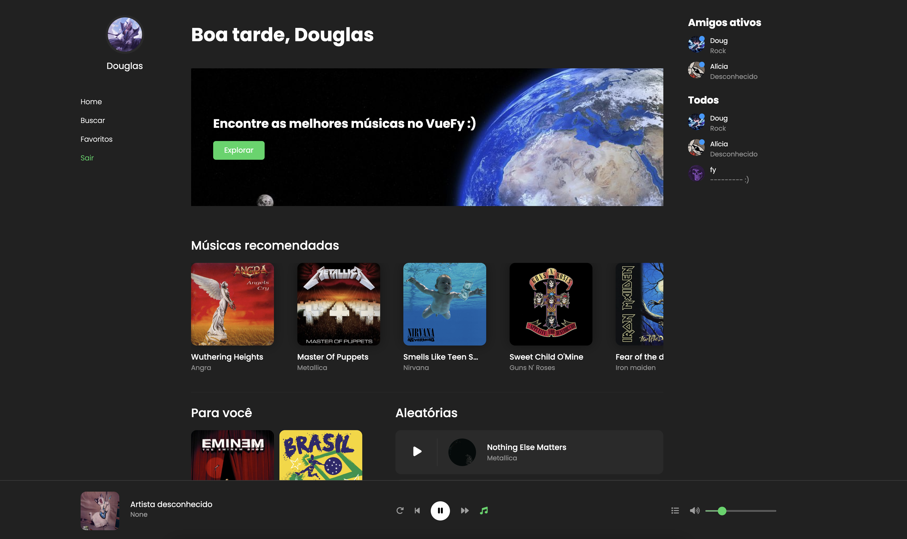

# VueFY

Projeto de músicas em vue para fixar conceitos iniciais.



## 🚀 Tecnologias

- ✔️ VueJS 3 - Framework web
- ✔️ Vue Router 4 - Roteamento para VueJS
- ✔️ Pinia - Gerenciamento de estado global
- ✔️ Vite - Bundler e dev-server

## 📦️ Pré-Requisitos

Antes de começar você vai precisar ter instalado na sua máquina as ferramentas [Git](https://git-scm.com/) e [Node](https://nodejs.org/en/download/).

## ⚡ Executando o projeto

1. Clone o repositório

```
    git clone https://github.com/DouglasLacerdaC/VueFY.git
```

2. Acesse a pasta do projeto e instale as dependências

```
    yarn
```

3. Execute o projeto

```
    yarn dev
```

4. Acesse pelo navegador

```
    http://127.0.0.1:5173/
```

5. Hey

```
    Aproveite e implemente mais conteúdo ao projeto. ;)
```

<br />

Desenvolvido por [Douglas Lacerda](https://www.linkedin.com/in/douglas-lacerda-da-conceicao/)
